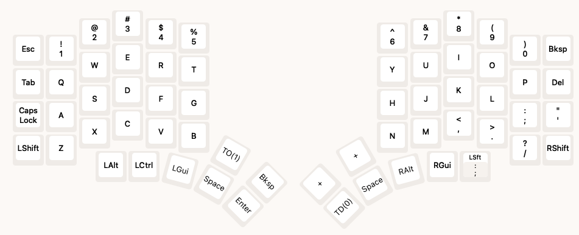

# SmolKeyboard

This repository contains all the files I used to configure my 62 keys split keyboard from [SplitKB (Halycon Elora)](https://splitkb.com/collections/keyboard-kits/products/halcyon-elora). I used Vial firmware to configure the keyboard (mainly because it has a nice GUI to configure the keyboard and because it supports live reprogramming).

The keyboard has a little oled screen on left side that display the current layer and a trackpad on the right side (for now, I mainly use keys to navigate the cursor, but having a trackpad can be useful in some situations when I need to be precise with the cursor position).

# Layout

The layout of the keyboard is as follows:

**Layer 0 (QWERTY)**
This is the default layer of the keyboard, which is a standard QWERTY, letting the operating system handle the key placement (I mainly use this layer for LUKS password input and when I need to type something quickly without thinking too much about the key placement, since ergol adaption is still in wip).

**Layer 1 (Custom Ergol)**
This is my custom layout based on [Ergol](https://ergol.org/) my common layout. Still in wip because I need to configure a lot of key overrides to make it work properly with the operating system.

**Layer 2 (Function layer)**
This layer contains the function keys, media keys, mouse keys and some other useful things.

**Layer 3 (special characters layer)**
This one is a layer that imitate the behavior of the [dead-key](https://en.wikipedia.org/wiki/Dead_key) on the ergol layout. It contains all the special characters that are not present on the main layers.

Many things will change soon as I am still experimenting with the layout. I'm still not sure about handling the placement of the keys on the computer side or directly on the keyboard side. Actually, the layer 0 is a simple QWERTY layout, letting the system handle the key placement, but the layer 1 is my custom layout (a custom [Ergol](https://ergol.org/) layout with few modifications).

At the time of writing, I'm currently on the layer 1 and having QWERTY configured on the computer side. This setup is quite comfortable but need some time to configure each touch (see more details below). 

# About the adaptation of Ergol layout

The main concern I had when configuring the keyboard with the key placement on the keyboard side is how certain keys are handled by the operating system. For example, with Ergol layout, the `.` and `:` are placed on the same key, and the `:` is obtained by pressing `Shift + .`. However, when I press `Shift + .` on my keyboard, the operating system will handle it as a QWERTY layout, resulting to a `>` character instead of `:`.

The solution about this is to [configure key overrides](https://docs.qmk.fm/features/key_overrides), which is a feature of QMK firmware that allows you to change the behavior of certain key combinations. For example, I can configure the keyboard to send `:` when I press `Shift + .`. The only drawback of this solution is that I need to configure each key combination that I want to change, which is be quite tedious.

