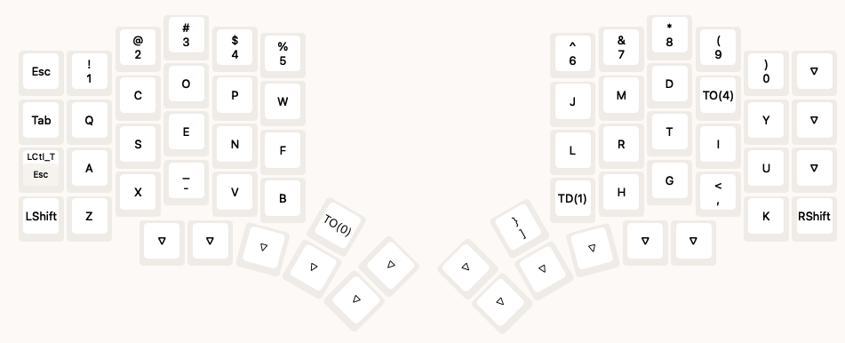
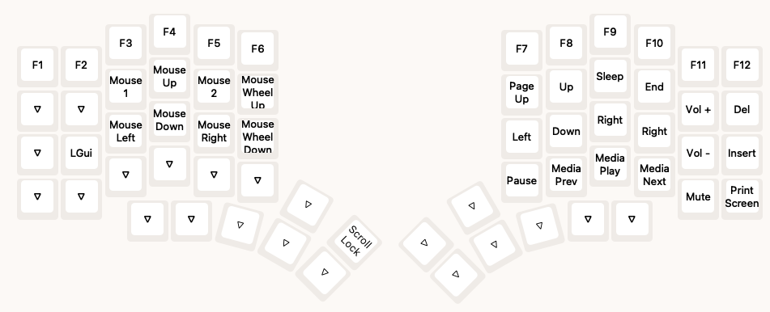
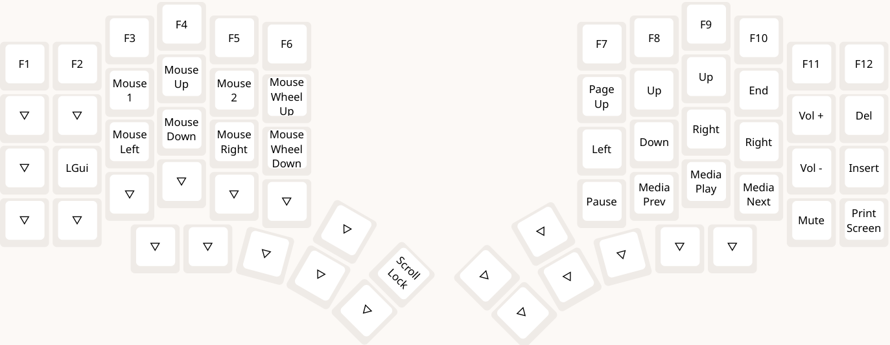

# SmolKeyboard

This repository contains all the files I used to configure my 62 keys split keyboard from [SplitKB](https://splitkb.com/collections/keyboard-kits/products/halcyon-elora). 

# Layout

The layout of the keyboard is as follows:

Many things will change soon as I am still experimenting with the layout.